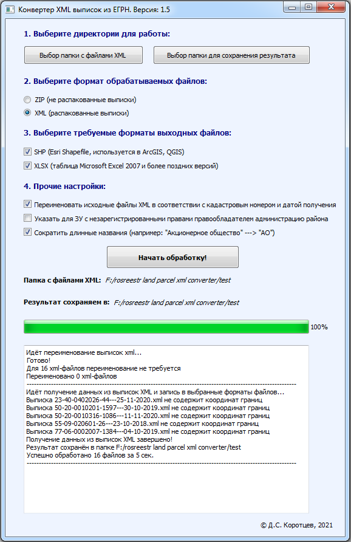

# rosreestr-xml-to-gis-converter
Позволяет конвертировать набор выписок в электронном виде (XML, распакованные или в исходном ZIP-архиве) из ЕГРН (Росреестра) 
на земельные участки, здания, сооружения, помещения в формат ESRI Shapefile (.shp) и таблицу (.xlsx, Microsoft Office Excel начиная с версии 2007)

Поддерживает следующие xml схемы выписок из ЕГРН:
1. urn://x-artefacts-rosreestr-ru/outgoing/kvzu/7.0.1 (Выписка полная из ЕГРН на земельный участок)
2. urn://x-artefacts-rosreestr-ru/outgoing/kpzu/6.0.1 (Выписка краткая из ЕГРН на земельный участок)
3. extract_about_property_land_v01.xsd Номер версии – 01 (Выписка полная из ЕГРН на земельный участок)
4. extract_base_params_land_v01.xsd Номер версии – 01 (Выписка краткая из ЕГРН на земельный участок)
5. extract_about_property_build_v01.xsd Номер версии – 01 (Выписка из ЕГРН на здание)
6. urn://x-artefacts-rosreestr-ru/outgoing/kvoks/3.0.1 (Выписка полная из ЕГРН на объект капитального строительства)
7. urn://x-artefacts-rosreestr-ru/outgoing/kpoks/4.0.1 (Выписка краткая из ЕГРН на объект капитального строительства)

Внимание: из ОКС пока поддерживаются только здания, сооружения, помещения

Чтобы полученный слой (формат .shp) правильно отображался в ГИС-системе, нужно указать для него соответствующую местную систему координат.
Например, приблизительные параметры для Mapinfo можно найти тут: https://mapbasic.ru/msksolutions
Кодировка текста в формируемом .shp - Windows-1251

Требования: *python 3.10 и более поздние версии*  
Установка зависимостей: *pip install -r requirements.txt*  
Для начала работы запустите файл main.py

